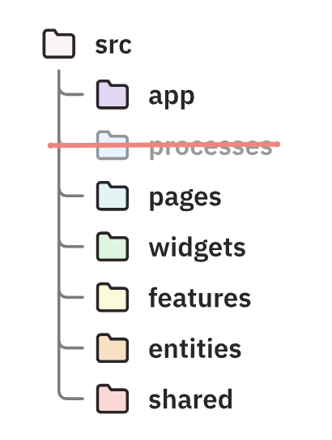

# RealWorld Example App

This codebase demonstrates a full-stack implementation [RealWorld] specification
with `Rust` (powering the [API]) and `TypeScript` (for the [end-user]
interfacing part).

## Technologies (non-exhaustive)

### Backend

- **[Axum]** - Modern async (`Tokio`) web framework for Rust
- **[Utoipa]** - Generated OpenAPI docs
- **[SQLx]** - Async SQL toolkit with compile-time checked queries
- **[OpenTelemetry]** - Observability and tracing
- **[PostgreSQL]** - Primary database
- **[Kamal]** - Zero-downtime deployments

### Frontend

- **[React]** 19.x with hooks and modern patterns
- **[Redux Toolkit]** - State management with RTK Query for API calls
- **[RTK Codegen OpenAPI]** - Hooks generation from OpenAPI docs
- **[React Hook Form]** - Form handling with Zod validation
- **[Webpack]** - Module bundler and dev server
- **[Kamal]** - Zero-downtime deployments

### Frontend architecture: FSD (Feature Slice Design)

### E2E Testing

- **[Testcontainers]** - Integration testing with real databases
- **[Fantoccini]** - Browser automation
- **[Chromedriver]** - WebDriver implemenation for `Chrome` browser

## Contributing

Contributions are _very_ welcome. Please find setup instructions for our frontend
and backend in corresponding directories.

## License

Licensed under either of [Apache License, Version 2.0][apache] or [MIT license][mit] at your option.

<!-- Links -->
[API]: https://api.realworld-axum-react.org/
[end-user]: https://app.realworld-axum-react.org/
[RealWorld]: https://github.com/gothinkster/realworld
[Axum]: https://github.com/tokio-rs/axum
[Utoipa]: https://github.com/juhaku/utoipa
[PostgreSQL]: https://www.postgresql.org/
[SQLx]: https://github.com/launchbadge/sqlx
[OpenTelemetry]: https://opentelemetry.io/
[Kamal]: https://kamal-deploy.org/
[React]: https://reactjs.org/
[Redux Toolkit]: https://redux-toolkit.js.org/
[RTK Codegen OpenAPI]: https://redux-toolkit.js.org/rtk-query/usage/code-generation
[React Hook Form]: https://react-hook-form.com/
[Webpack]: https://webpack.js.org/
[Testcontainers]: https://testcontainers.com/
[Fantoccini]: https://github.com/jonhoo/fantoccini
[Chromedriver]: https://developer.chrome.com/docs/chromedriver/downloads
[apache]: https://www.apache.org/licenses/LICENSE-2.0
[mit]: https://opensource.org/licenses/MIT
